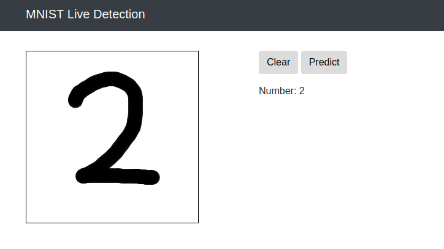

# Interactive MNIST Draw Classification
[Live Application here](https://mnist-draw.herokuapp.com/)
### Deep Learning Pytorch and Flask as Web App
Here we will present a simple method to take a Pytorch model and create Python Flask Web App.

Specifically, we will:

  - Load a Pytorch model into memory so it can be efficiently used for inference
  - Use the Flask web framework to create an app
  - Make predictions using our model, and return the results to the UI
  - Configure our development environment

We’ll be making the assumption that Pytorch is already configured and installed on your machine. If not, please ensure you install Pytorch using the official install instructions. We’ll need to install Flask, it is a Python web framework, so we can build our API endpoint. We’ll also need requests so we can consume our API as well.

Also we will use the requirements file. We use it to simple load dependencies. We must to use the below command to load dependencies (it probably fail, so remove the torch dowload line from next file).
```sh
 $ pip install -r requirements.txt
```

### Create your Digit Recognizer - MNIST
We create a app.py class and we use a model trained with the database [MNIST](http://yann.lecun.com/exdb/mnist/) with our model_train.ipynb.
We created one endpoint service 'predictModel'. Firstly, we capture the draw information of the canvas from the client and the, on our server, we decode the data information from the canvas (on base64). Then, the image is passed to our model and we return the predictions.
## Starting the Server
The Flask + Pytorch server can be started by running:
```sh
 $ python app.py
```

Note: For Free Heroku account only 500MB of space will be allocated, GPU version of pytorch takes huge space. So, use CPU version of pytorch for Inference. 



We have successfully called our Pytorch model and we can draw over a canvas and pass the images to our model :)
